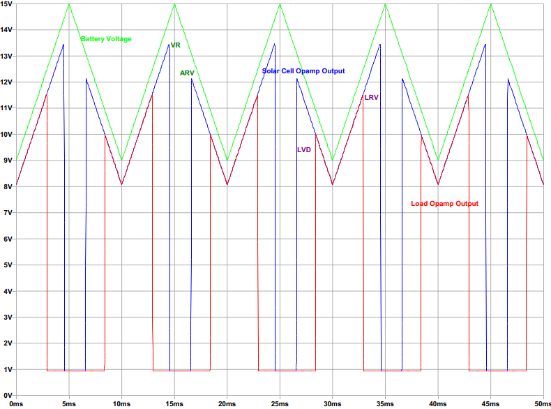

# `Solar-Charge-Controller` 
  

  

  
  

## Specifications

 ##### Battery Voltage : 12V
 ##### VR = 14.4V, ARV = 13.0V
 ##### LVD = 10.8V, LRV = 12.5V

## Schematic

  

## Tuning the Circuit

  
   
  

## Simulation Result

  

## License

This work is licensed under `Apache License 2.0`
